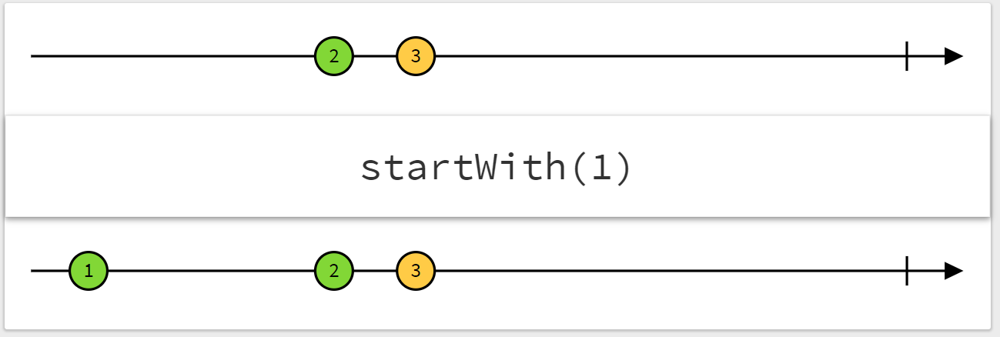
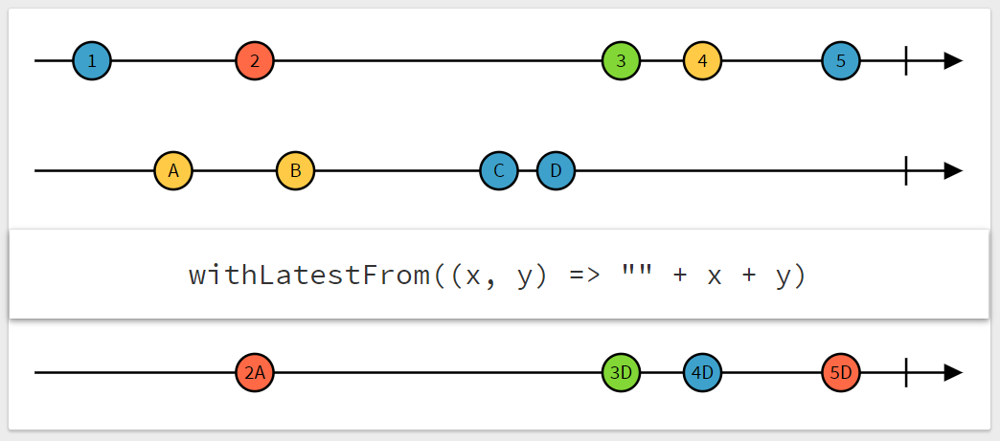

# RxJSの紹介

## RxJSとは

* **R**eactive E**x**tension for **J**ava**S**cript  
  リアクティブプログラミング用のJavaScriptのライブラリ


## この記事について

本記事は、リアクティブプログラミングを知らない人向けに、
RxJSなどのリアクティブプログラミング用ライブラリを用いるメリットを
実例を通して具体的に紹介し、使えるようになってもらうことが目的です。
RxJSの内部実装には触れません。

JavaScriptをある程度書いたことがある人を想定しています。

RxJSを利用することには以下のような利点があります。

* 複数のイベントを含む非同期処理データフローを正確に効率よく実装できる
* ある変数の値を更新するときに依存している変数の値の更新を芋づる式に行わせることができる
	（**ある変数の値の変更を監視し処理を登録するようなことができる**）
* 相互依存性の低いプログラムになる
* データの加工が直感的に行える
* ロジックと表示処理を分離できる

これらの利点を理解して実用できるようになるために、
次節で説明するようなデータテーブルアプリケーションを実装してみます。
RxJSを使わない実装とRxJSを使った実装を比較することで、
具体的にRxJSを使うメリットを確認することが目的です。

キーワード：
RxJS, Observable, JavaScript, リアクティブプログラミング


## DataTableApp

今回は例として、以下のリンク先のような
フィルタリングとページネーション機能を持つデータテーブルを実装します。（以降はDataTableAppと呼ぶことにします）

[DataTableApp](https://codepen.io/pikohideaki/full/LrLzLX/)

### DataTableAppの説明

DataTableAppの機能と具体的な動作の流れを説明します。


#### データの取得と表示

1. まずhttp requestでCSVファイルの内容を取得し、変数`csvText`に格納します。
    * CSVファイル：[testdata.csv](https://dl.dropboxusercontent.com/s/d76vdmr3jafwg3j/testdata.csv)
    * 内容は「番号」「名前」「Eメールアドレス」「性別」の4列からなる以下のようなCSVファイルです。

```txt
1,Helaina Cunnell,hcunnell0@va.gov,Female
2,Wenda Teacy,wteacy1@4shared.com,Female
3,Fidelia Clayworth,fclayworth2@biblegateway.com,Female
4,Carlynne Duesbury,cduesbury3@nba.com,Female
5,Burton Bricknall,bbricknall4@altervista.org,Male
6,Liana Hearnden,lhearnden5@google.ca,Female

...

```

2. `csvText`を取得したら関数`CSVtoTable`によりCSV文字列を、
    文字列を要素とする二次元配列に変換した`table`を作ります。
3. `table`が準備できたら、3つのテキストボックス（名前、Eメールアドレス、性別）の入力値に応じて
    `table`をフィルタした結果のテーブル`tableFiltered`を作ります。
    最初はテキストボックスは空欄なので`tableFiltered`は単に`table`のコピーとなります。
4. `tableFiltered`が準備できたら、
    1ページあたりの表示行数`itemsPerPage`とページ番号`currentPage`の値に従って
    現在のページ部分を切り出した`tableSliced`を作ります。
5. `tableSliced`が用意できたらこれを表示します。
    以降も、`tableSliced`が更新されるたびに表示の更新を行います。
    最初の`table`取得以降の`tableSliced`の更新は、
    次のページネーション機能のページ変更や表示行数変更により発生します。


#### フィルタリング

3つのテキストボックス（名前、Eメールアドレス、性別）の入力値に応じてフィルタリングを行います。
各列について、テキストボックスに入力された文字列を部分文字列として含む行のみ表示します。
今回の実装では大文字小文字は完全一致判定としています。
フィルタリングは、文字列の入力の途中でも即座に行います（インクリメンタルサーチのような処理）。


#### ページネーション

ページネーション機能は以下のように動作します。

* ページ番号`currentPage`を指定すると、表データの該当するページ部分を表示します。
    * `currentPage`を指定するテキストボックスに入力があったら
        `currentPage`をその値に更新し、
        `table`から現在のページ部分を切り出したデータで`tableSliced`を更新し、
        表示します。
* 1ページあたりの表示行数`itemsPerPage`を変更できます。
    * デフォルトは50行としています。
    * `itemsPerPage`を指定するテキストボックスに入力があったら
        全ページ数`pageLength`と`tableSliced`を計算し更新します。
    * `itemsPerPage`変更により全ページ数`pageLength`の値が変更されたら
        `currentPage`を1にリセットします。
        * 例えば、
            テーブルが1000行のとき、
            1ページ100行表示で8ページ目を選択したまま1ページ200行表示にすると、
            全ページ数が5となるので、
            表示ページが8ページ目のままだと存在しないページを表示することになってしまいます。
            ページ番号を1にリセットするのはこれを避けるためです。


#### テキストボックスの間引き処理

DataTableAppでは、
フィルタリング用テキストボックスや
`currentPage`や`itemsPerPage`の値を変えると
自動的に`tableFiltered`や`tableSliced`を更新＆表示するようにしています。
しかし、テキストボックスへの入力途中に
短時間に何度もフィルタ・スライス処理と表示が行われると、
テーブルデータが巨大な場合に高負荷がかかってしまいます。
これを避けるため、テキストボックス入力イベントの発生時の処理は
300ミリ秒以内に複数回行わないように間引き処理を加えています。


### DataTableAppの処理の流れ

以上で説明したDataTableAppのデータの処理の流れを図示すると以下のようになります。


青枠の要素は変数（データ）を表し、矢印と緑の四角はデータフローとその処理を表します。
変数のうち、イベントの発火点となる変数は黄色く表示しています。
タイマーのような記号はイベント処理の間引きを表しています。


## 実装

以上の機能を備えたDataTableAppを実装しようとする場合、
テキストボックスに文字が入力された時やcsvファイルの取得が完了した際に
行う処理を登録する必要があります。
このようなイベントの発生に応じて行う処理の登録には、
`addEventListener`というメソッドを使うのが一般的です。
（jQueryのonメソッドはこれとほぼ同じ働きをします。）

たとえば，

```html
<div>
    <input type="text" id="full-name">
    <label for="full-name">FullName</label>
</div>
```

というinput要素に文字が入力されたときに行う処理を登録したいときは，

```js
document.getElementById('full-name')  // idがfull-nameの要素を指す
    .addEventListener('input', event => {
        /* ここに処理を書く */
    });
```

のように書きます。
`addEventListener`の1つ目の引数は発火させるイベントの種類で、
`'input'`ならば文字が入力されるたびに発火し、登録した処理を行います
（代わりに`'change'`を指定すると、文字入力が完了してテキストボックスからフォーカスが外れたときに発火します。
`<button>`要素なら`'click'`でクリック時の処理を登録します）。

名前の列のフィルタリング用テキストボックスに入力があったときに必要な処理を記述すると、以下のようになります。

```js
document.getElementById('full-name')  // idが'full-name'の要素を指す
  .addEventListener('input', event => {
    fullName = (event.target.value || '');
    updateTableFiltered();
    updateAndPrintTableSliced();
  });
```

`event.target.value`はテキストボックスに入力された文字列（`event`オブジェクトはほかにも様々な情報を含んでいます）です。
デフォルト値`''`とORをとって`fullName`に入れています。
`updateTableFiltered()`はフィルタを行い`filteredTable`を更新する処理、
`updateAndPrintTableSliced()`はスライスを行い`slicedTable`を更新し表示する処理です。


これに、300ミリ秒に2回以上発火しないように間引き処理を加えるには、少し分かりにくいですが以下のようにします。

```js
let timerId;
document.getElementById('full-name')  // idが'full-name'の要素を指す
  .addEventListener('input', event => {
    clearTimeout(timerId);  // 前回の予約をキャンセル
    timerId = setTimeout( () => {  // 処理を予約し予約番号をtimerIdに控える
        fullName = (event.target.value || '');
        updateTableFiltered();
        updateAndPrintTableSliced();
    }, 300 );
  });
```

元の処理を`setTimeout`で処理を300ミリ秒後に予約し、
それから300ミリ秒以内に立て続けに'input'イベントが発生したら
`clearTimeout`により前回の予約をキャンセルし再予約するという仕組みです。
（後の節で説明しますが、このトリッキーな間引き処理の実装の分かりにくさも、RxJSを使えば綺麗に解決できます。）

---


1ページあたりの表示行数`itemsPerPage`の場合は以下のようになります。

```js
let timerId;
document.getElementById('items-per-page')
  .addEventListener('input', event => {
    clearTimeout(timerId);
    timerId = setTimeout( () => {
        itemsPerPage = (event.target.valueAsNumber || 50);  // テキストボックス内の値を数値として取出す
        currentPage = 1;  // リセット
        updateAndPrintTableSliced();
    }, 300 );
  });
```

こちらはフィルタリングは必要ありませんが、現在のページを1にリセットする処理も書いておきます。
前述の`updateTableFiltered()`にも現在のページを1にリセットする処理を含むようにします。

```js

// tableFilteredの更新
const updateTableFiltered = () => {
  tableFiltered = table.filter( line => filterFn( line, fullName, emailAddress, gender ) );
  updatePageLength();
};


// tableSlicedの更新
const updateAndPrintTableSliced = () => {
  const range = getRange( itemsPerPage, currentPage );

  tableSliced = tableFiltered.slice( range.begin, range.end );  // 更新

  // 表示処理
  $range.innerText
    = `(${range.begin + 1}-${range.end}) of ${tableFiltered.length} items`;

  printTable( tableSliced );
};
```


同じ要領で他のイベント発火点に対しても実装します。
このような実装方法を以降は「コールバック関数による実装」と呼ぶことにします。
（他の関数の引数として渡して処理させる関数のことをコールバック関数と言います。
`event => { /* 処理 */ }`という部分がコールバック関数です。）

---

以上で各イベントに対応する処理を実装できました。
ソースコード全体は以下で確認できます。

リンク or collapse

ここで、コールバック関数によるプログラムを図にしてみます。

図

この図から分かる通り、コールバック関数による実装では、実は厳密には図1の通りに処理を実装しているわけではありません。
各イベントに対して行うべき処理を過不足なく記述したつもりが、データフローの再構成（直列化）を含んでいたと言うことができます。
それだけでなく、（今回実装するDataTableAppでは問題になることは無さそうですが）
この違いが誤作動を引き起こす可能性も場合によってはあると思われます。
また、コールバック関数による実装では、それぞれのコールバック関数は独立に実行されるので、
テキストボックスに施したような間引き処理を下流側の変数に対して行おうとすると、
データフローの構造によってはかなりトリッキーな実装が必要となるという弱点もあります。

コールバック関数によるナイーブな実装は、データフローの再構成の手間が増えているだけでなく、
それによる意図しない動作の可能性や機能追加の難しさという欠点があることが分かりました。
では、図1のデータフローそのままに効率良く実装するためにはどうすれば良いのでしょうか？
一つの良い方法は今回紹介するRxJSのようなリアクティブプログラミング用のライブラリを使う方法です。
今回利用するのはその中でも"Observable"とそれに対する変換・合成などの処理を行う関数やオペレータです。

## Observable

RxJSを使う実装では、ただの変数の代わりにObservableを使います。
Observableとは、**値が変わったときに発火する変数**のようなものです。

Observableが発火すると、
このObservableに依存している他のObservableに値の更新を伝播して発火させたり、
このObservableに対して`subscribe`メソッドで登録した処理を行う
などの働きをします。

Observableは一から作るか、他のObservableを組み合わせたり加工することで生成します。
一から作るにはいくつか方法はいくつかありますが、今回は`fromEvent`というメソッドのみ使います。
`fromEvent`を使うと、以下のように、ボタンを押すと発火するObservableを作ることができます。
発火時の処理`alert('Hello, world!')`をsubscribeにより登録しています。


例

テキストボックスの入力時に発火するObservableも同様です。

例


Observableは`pipe`メソッドを持ち、様々なオペレータを渡すことでObservableを加工することができます。
以下の例では、`map`オペレーターにより、入力のアルファベット文字列を大文字に変換したものを出力するObservableを作っています。

例

`map`オペレーターの働きを図にすると以下のようになります。
横軸は時刻で、上のObservableをオペレーターで変換した結果が下のObservableになるという意味です。


---

これらを用いて、DataTableAppの実装を改良していきます。

fullName取得部分のコールバック版の実装を再掲します。

```js
let timerId;
document.getElementById('full-name')  // idが'full-name'の要素を指す
  .addEventListener('input', event => {
    clearTimeout(timerId);  // 前回の予約をキャンセル
    timerId = setTimeout( () => {  // 処理を予約し予約番号をtimerIdに控える
        fullName = (event.target.value || '');
        updateTableFiltered();
        updateAndPrintTableSliced();
    }, 300 );
  });
```

RxJS版だと次のようになります。

```js
const fullName$ = fromEvent( document.getElementById('full-name'), 'input' )
                      .pipe( map( event => (event.target.value || '') ),
                             debounceTime(300),
                             startWith('') );
```

`pipe`メソッドに渡したオペレーターにより、inputイベントから作ったObservableを順番に加工しています。
`map( event => (event.target.value || '')`はeventオブジェクトからテキストボックス内の文字列を取り出しています。
`debounceTime(300)`は、元のObservableで300ミリ秒以内の間隔で連続している発火を最後の1回だけにまとめるオペレーターです。
`startWith('')`は変数の初期化のようなもので、inputイベントの発火前に初期値`''`で1度発火するようにしています。

debounceTime，startWithの働きは図にすると以下のようになります。




よく見ると`updateTableFiltered()`や`updateAndPrintTableSliced()`に対応する処理は書いていないのですが、
fullNameを表すObservableとしてはこれで完成です。
tableFilteredやtableSlicedというデータは、
fullNameなどの値に**依存している**データなので、
Observableによる実装ではその**依存関係を記述**し**値の更新の伝播**により処理させます。

他のテキストボックスに対応するObservable（`email$`, `gender$`）も同様に作ります。


---

itemsPerPageも同様です。

```js
const itemsPerPage$ = fromEvent( document.getElementById('items-per-page'), 'input' )
                          .pipe( map( event => ( event.target.valueAsNumber || 50 ),
                                 debounceTime(300),
                                 startWith(50) );
```


---


テーブル全体を表すObservable`table$`の発火する値を
テキストボックスに対応するのObservable（`fullName$`, `email$`, `gender$`の3つ）により
フィルタした後のテーブル`tableFiltered$`は以下のように作ります。

```js
const tableFiltered$ = combineLatest(
                            table$,
                            fullName$,
                            email$,
                            gender$,
                            (table, fullName, email, gender) =>
                                table.filter( line => filterFn( line, fullName, email, gender ) ) );
```

`combineLatest`はいくつかのObservable `a$, b$, ... z$` と
関数`f := (a, b, ..., z) => 《出力する値》`を1つ受け取り、
そのいずれかのObservableが発火したときに`a$, b$, ... z$`の最新の値`a, b, ..., z`を
`f`により合成・変換した結果を発火するObservableを作ります。
図にすると以下のようになります。


---

`currentPage$`は少し複雑です。


```js
const currentPage$ = merge(
                        fromEvent( document.getElementById('current-page'), 'input' )
                          .pipe( map( event => event.target.valueAsNumber ),
                                 map( val => (val || 1) ),
                                 debounceTime(300) ),
                        itemsPerPage$.pipe( map( _ => 1 ) ),
                        tableFiltered$.pipe( map( _ => 1 ) )
                      ).pipe( startWith(1) );
```

`fromEvent(＊).pipe(＊＊)`の部分はほぼ同じですが、
総ページ数が変わったときに現在のページを1にリセットする処理のために
`itemsPerPage$`や`tableFiltered$`の発火時に`1`を発火するようにしています。

`merge`はいくつかのObservable `a$, b$, ... z$`を受け取り、
そのいずれかのObservable`x$`が発火したときにその（最新の）値`x`を発火するObservableを作ります。
図にすると以下のようになります。


あるいは、以下のように`pageLength$`という補助的なObservableを挟んだ方が意味が分かりやすく間違いがないかもしれません。

```js

// ページ数
const pageLength$
  = combineLatest(
        tableFiltered$.pipe( map( tableFiltered => tableFiltered.length ) ),
        itemsPerPage$,
        (tableLength, itemsPerPage) => Math.ceil( tableLength / itemsPerPage ) )
      .pipe( startWith(0) );

const currentPage$ = merge(
                        fromEvent( document.getElementById('current-page'), 'input' )
                          .pipe( map( event => event.target.valueAsNumber ),
                                 map( val => (val || 1) ),
                                 debounceTime(300) ),
                        pageLength$.pipe( map( _ => 1 ) )
                      ).pipe( startWith(1) );

```


---

`tableSliced$`は`tableFiltered$`, `itemsPerPage$`, `currentPage$`の3つを組み合わせて作ります。
まずは`tableFiltered$`から現在のページとして切り出す範囲を表すObservable`range$`を以下のように作ります。

```js
// 表示するページの範囲
const range$
  = combineLatest( itemsPerPage$, currentPage$,
      (itemsPerPage, currentPage) => getRange(itemsPerPage, currentPage) );
```

`getRange`は以下のように現在のページの範囲を表すオブジェクト`{ begin: number, end: number }`を返す関数です。
最終的にこの値は`[begin, end)`という範囲を切り出すのに使われます。
（`getRange( 100, 3 )`の結果は`{ begin: 200, end: 300 }`になります。）

```js
// 1ページ表示行数とページ番号を受け取ってテーブルの現在のページ部分の範囲のインデックスを計算し、
// その範囲を表すオブジェクト { begin: number, end: number } を返す。
const getRange = (itemsPerPage, currentPage) => ({
  begin: itemsPerPage * (currentPage - 1),
  end:   itemsPerPage * currentPage
});
```

最後に`range$`と`tableFiltered$`を組み合わせて`tableSliced$`を作ります。

```js
// tableの表示するページ部分
const tableSliced$
  = range$.pipe(
        withLatestFrom( tableFiltered$ ),
        map( ([range, tableFiltered]) =>
              tableFiltered.slice( range.begin, range.end ) )
      );
```

`withLatestFrom`は`comnbineLatest`に似た動作で、
複数のObservableの最新の値を組み合わせたObservableを作りますが、
元のObservableの発火するタイミングを変化させないという特徴があります。
`a$.pipe( withLatestFrom( b$ ) )`とすると
発火するタイミングは`a$`と同じままで、`a`ではなく`[a, b]`という配列（タプル）を発火するObservableになります。
図にすると以下のような動作です。



`tableFiltered$`の発火時に発火させないようにするのは、
`tableFiltered$`の発火時には必ず`currentPage$`が発火しているので無駄に2回発火しないようにするためです。（ここは気づきにくく、combineLatestで実装してしまいそうですが、このような微小時間に連続した発火はdebounceTimeなどで抑えるという手もありそうです）


---

最後に`tableSliced$`の表示処理を記述します。
`subscribe`メソッドで`tableSliced$`発火時に関数`printTable`を呼んでいます。

```js
// テーブルを表示
tableSliced$.subscribe( tableSliced => {
  printTable( tableSliced );
});
```


---

DataTableAppのロジックのRxJS化の最も重要な部分の説明はこれで完了です。
あとは大元のデータであるtable$の作成や関数の実装が必要ですが、
以下にソースコード全体をコールバック版も合わせて貼っておきますので、
詳細はそちらを参照ください。
各ソースコードは、以下のように配置してindex.htmlを開けば動くようになっています。コールバック版とRxJS版のJavaScriptソースはindex.html内のコメントアウトで切り替えて下さい。


