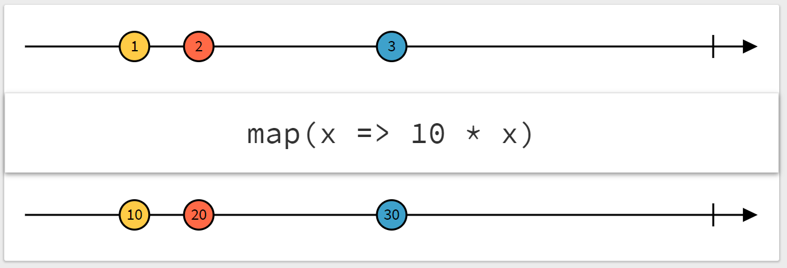

#### JavaScript部分の解説

以上の説明に合うように具体的にJavaScriptでの処理を記述していきます。


* まずは図に現れる要素に対応する変数を宣言しておきます。


```js
// 各列のテキストボックスの値
let id = '';
let firstName = '';
let lastName = '';
let email = '';
let gender = '';
let IPAddress = '';

let itemsPerPage = 50;  // 1ページに表示する列数
let pageNumber = 1;  // 現在のページ番号
let pageLength = 1;  // ページ数

let table = [];  // テーブルデータ
let tableFiltered = [];  // フィルタ後のテーブルデータ
let tableSliced = [];  // tableFilteredのうち現在のページの部分
```


* 次にCSVファイルを取得します。
`CSVtoTable`はCSV文字列をテーブル変換する関数、
`filter`は`table`をフィルタし`tableFiltered`を更新する関数、
`updatePageLength`は`tableFiltered`と`itemsPerPage`から
ページ数を計算し`pageLength`を更新する関数、
`slice`は`tableFiltered`から現在のページに該当する行を切り出し
`tableSliced`を更新する関数、
`renderAll`は計算後の諸々の値を表示する関数です。
（記事中では`CSVtoTable`, `filter`, `slice`の中身の説明は省略します。
ソースコードは末尾のリンク先を参照ください）


```js
const req = new XMLHttpRequest();
req.open('get', 'https://dl.dropboxusercontent.com/s/i480egosiyzkpu3/sample.csv', true);
req.send(null);
req.addEventListener('load', event => {
  const csvText = event.target.responseText;
  table = CSVtoTable( csvText );
  filter();
  updatePageLength();
  slice();
  renderAll();
});
```

* テーブル各列のテキストボックス入力イベントに対する処理を登録します。
    ここではfirst-nameの列のみ載せますが他の列の処理も同様です。
    `addEventListener`というメソッドは、
    documentの指定した要素（`getElementById`で取得しています）に
    指定した種類のイベント（ここでは`input`＝1文字入力or削除したとき）
    が起きたときに行う処理を登録するメソッドです。
    `tableFiltered`, `tableSliced`, `pageLength` が変化します。

```js
document.getElementById('first-name')  // first-nameの入力欄
  .addEventListener('input', event => {
    firstName = event.target.value;
    filter();
    updatePageLength();
    slice();
    renderAll();
  });
```

* 1ページに表示する行数を指定するテキストボックスの値を変えたときの処理を
    同様に登録します。
    `tableSliced`, `pageLength`は変化しますが
    `tableFiltered`は変化しないのでこのイベントではフィルタは不要です。

```js
document.getElementById('items-per-page')  // items-per-pageの入力欄
  .addEventListener('input', event => {
    itemsPerPage = event.target.valueAsNumber;
    updatePageLength();
    slice();
    renderAll();
});
```

* ページ番号を変えたときの処理を登録します。
    変化するのは`tableSliced`です。

```js
document.getElementById('page-number')  // page-numberの入力欄
  .addEventListener('input', event => {
    pageNumber = event.target.valueAsNumber;
    slice();
    renderAll();
});
```

* `updatePageLength`の内容は以下の通りです。
    JavaScriptでは`/`は浮動小数演算になるため`Math.ceil`で切り上げる必要があります。
    （500行のテーブルで1ページ200行表示ならページ数は3）

```js
const updatePageLength = () => {
  pageLength = Math.ceil( tableFiltered.length / itemsPerPage );
};
```

* `renderAll`の内容は以下の通りです。
`pageLength || 1`という部分は、
`pageLength`の値が`undefined`のとき`1`になるようにデフォルト値を設定しています。


```js
const renderAll = () => {
  // テーブルを表示
  setTableData( document.getElementById('my-data-table'), tableSliced );

  // フィルタ後の行数を表示
  document.getElementById('nof-items').innerText = tableFiltered.length;

  // ページ数を表示
  document.getElementById('page-length').innerText = (pageLength || 1);

  // 1ページあたりの表示行数を指定するテキストボックスの値を更新
  document.getElementById('items-per-page').value = (itemsPerPage || 50);

  // ページ番号を指定するテキストボックスの値を更新
  document.getElementById('page-number').value = (pageNumber || 1);
};
```


#### 実装

図に示した修正を具体的に実装します。


* `pageLength`に変更があったときに`pageNumber`を1にする処理は
    関数`updatePageLength`に次のように処理を追加するだけです。

```js
const updatePageLength = () => {
  pageLength = Math.ceil( tableFiltered.length / itemsPerPage );
  pageNumber = 1;  // これを追加
};
```

* 問題の間引き処理ですが、
    `setTimeout`と`clearTimeout`という関数を使うことでこれを実装できます。
    `setTimeout`は引数2に指定した時間（ミリ秒）後に
    引数1に与えた関数を実行する予約をし、そのidを返します。
    `clearTimeout`は、`setTimeout`で設定した予約をキャンセルする関数です。
    inputイベントが発生すると、
    `clearTimeout`が前回の`setTimeout`をキャンセル（未処理の場合のみ）してから
    次の`setTimeout`を行うので、
    300ミリ秒以内に2回以上フィルタが実行されることはなくなります。

```js
let timerId;
document.getElementById('first-name')  // first-nameの入力欄
  .addEventListener('input', event => {
    clearTimeout(timerId);
    timerId = setTimeout( () => {
      firstName = event.target.value;
      filter();
      slice();
      renderAll();
    }, 300 );
});
```

#### 不満点

しかし、この実装には次のような不満点があります。

1つ目は記述量が多い点です。
先ほどの`setTimeout`等を用いたフィルタ処理は各列に対して記述せねばならず、
列数に比例してコードを書かなければなりません。
共通部分を関数化する手もありますが、
それで分かりやすくなるかというとそうでもなさそうです。

2つ目はコードを読んだときに意味が分かりにくい点です。
`setTimeout`で書いた間引き処理は
「300ms以内の連続した入力では発火しない」
という意味を直感的に読み取るのが難しく、読みづらいコードです。

そして3つ目は、そもそもVersion 1 も 2 も、
各イベントに対応する処理をすべてその場で書いている点です。
各inputイベントに対して、

* テーブルヘッダのフィルタ文字列の変更なら
    `filter` => `updatePageLength` => `slice` => `renderAll`
* 表示行数の変更
    `filter` => `updatePageLength` => `slice` => `renderAll`
* ページの変更なら `slice` => `renderAll`

というように、その変数の値に依存するすべての変数を
『順番を間違えずに』『過不足なく』更新し、表示しなければなりません。
手続き的なプログラミングスタイルに慣れ親しんだ人にとっては当たり前で気づかない点かもしれませんが、
このような実装の仕方では、
変数の依存関係の全体像（さっきの図）を常に意識しなければなりません。
このような相互依存性の高いプログラムは、
変数が多くなるにつれ急激に複雑になってしまいます。
さらに言えば、`renderAll`も場所によっては必要のない変数まで表示を更新しており非効率的です（本来は処理に応じて変化した部分だけ更新すべきですが、値が変わっているにもかかわらず表示を更新し忘れるのを防ぐため、また、あまりJavaScriptのコードを表示のために割きたくないためにこのような手抜きをしています）。

これらの不満をすべてスマートに解決してしまうのが、次節で紹介する**RxJS**です。


### 3. RxJSを使ってリアクティブに実装 (Version 3)

RxJSによる実装では、ただの変数の代わりに **"Observable"** というものでデータを表します。

Observableの説明の仕方は色々あると思いますが、
個人的には
**Observable** ≒「値が更新されたときに発火する変数」
とイメージすれば分かりやすいと思っています。
Observableが発火すると、
このObservableに依存している他のObservableに値の更新を伝播して発火させたり、
このObservableに対して`subscribe`というメソッドで登録した処理を行う
などの働きをします。

Observableの作り方には複数の方法があります。
今回用いるのはイベント（inputイベントやhttp requestの完了イベントなど）からObservableを作る方法と、
既に作られた一つまたは複数のObservableを組み合わせて加工する方法です。
前者には`fromEvent`というメソッドを用い、後者には`pipe`メソッドや`combineLatest`、`merge`などの関数を用います。
各メソッドや関数については次節で実際のコードも交えながら説明していきます。

RxJSではこのObservableの依存関係を記述することで処理を実装します。


#### 実装

それでは、RxJSによる具体的な実装を説明していきます。

実装の全体の流れは、


1. 図2. data_flow_after の各要素をObservableとして定義することで依存関係を記述する
2. 最終的に表示される値を保持するObservableに`subscribe`メソッドで表示処理を記述する

という2段階となります。


----------

CSVデータの取得部分は次のようになります。

```js
const req = new XMLHttpRequest();
req.open('get', 'https://dl.dropboxusercontent.com/s/i480egosiyzkpu3/sample.csv', true);
req.send();  // 通信開始
const csvText$ = fromEvent( req, 'load' )
                    .pipe( map( event => event.target.responseText ),
                           startWith('') );
```

`csvText$`はObservableです
（Observableは普通の変数と区別するために末尾に`$`を付けることが多いです）。
`fromEvent`はイベントからObservableを作る関数です。
`fromEvent( req, 'load' )`の部分は`req`の`'load'`イベントが発生すると発火するObservableを表します。
`pipe`は渡された引数によりObservableを順番に加工したObservableを返します。
`map`は引数に渡した関数で変換した値を出力するObservableに加工するオペレータ、
`startWith`は元のObservableが最初に発火する値を追加するオペレータです。

オペレータの処理を図で表すと以下のようになります
（[RxJS Marbles](http://rxmarbles.com/)から引用）。
横軸は時刻を表します。




`csvText$`は結局、最初に初期値`""`で発火し、
httpリクエストでCSVテキスト文字列が取得でき次第、
その文字列を発火するObservableと定義されます。

----------


`firstName$`は以下のように、inputイベントから`fromEvent`により作られたObservableに
`debounceTime`による間引き処理を含むいくつかの加工を施したものと定義します。

```js
const firstName$ = fromEvent( document.getElementById('first-name'), 'input' )
                      .pipe( map( event => event.target.value ),
                             debounceTime(300),
                             startWith('') );
```

`debounceTime`というオペレータを挟むと、その引数に渡した時間（ミリ秒）
以内の連続した発火を抑えて出力するようになります。


----------


`table$`は`csvText$`の発火する値を
`CSVtoTable`関数で変換した値を発火するObservableとします。
関数`CSVtoTable`はVersion1, 2に出てきたものと同じものです。

```js
const table$ = csvText$.pipe( map( CSVtoTable ) );
```

----------


`tableFiltered$`は`table$`と各列のフィルタ文字列Observableを組み合わせて
filterした値を発火するObservableです。
`filterFunction`はVersion 1,2のものと同じです。

```js
const tableFiltered$ = combineLatest(
                            table$,
                            id$,
                            firstName$,
                            lastName$,
                            email$,
                            gender$,
                            IPAddress$,
                            (table, ...input) =>
                                table.filter( line => filterFunction( line, ...input ) ) );
```

`combineLatest`は可変長引数関数で、
(n - 1)個のObservableと1個の関数を受け取りObservableを作ります。
(n - 1)個のObservableのいずれかが発火した際に、
それらが最後に発火した値を
n番目の引数の関数でマップした値を出力するObservableとなります。


----------


`itemsPerPage$`も同様です。


```js
const itemsPerPage$ = fromEvent( document.getElementById('items-per-page'), 'input' )
                          .pipe( map( event => event.target.valueAsNumber ),
                                 map( val => (val || 50) ),
                                 debounceTime(300),
                                 startWith(50) );
```

----------


`pageLength$`も`combineLatest`で作ることができます。

```js
const pageLength$ = combineLatest(　tableFiltered$,　itemsPerPage$,
                        (table, itemsPerPage) =>　Math.ceil( table.length / itemsPerPage ) )
                      .pipe( startWith(1) );
```

----------

`pageNumber$`はinputイベント以外に
`pageLength$`の発火で`1`にリセットする処理も必要なので
`merge`という関数で複数のObservableを合わせた作ります。
`merge`は
n個のObservableを受け取り、
いずれかが発火した際にその値を発火するObservableを作る関数です。

```js
const pageNumber$ = merge(
                        fromEvent( document.getElementById('page-number'), 'input' )
                          .pipe( map( event => event.target.valueAsNumber ),
                                 map( val => (val || 1) ),
                                 debounceTime(300) ),
                        pageLength$.pipe( map( _ => 1 ) )
                      ).pipe( startWith(1) );
```

----------


`tableSliced$`は `itemsPerPage$`, `pageNumber$`, `tableFiltered$`
の最新の値を組み合わせて次のように表現できますが、少し
点があります。

```js
const tableSliced$ = combineLatest( itemsPerPage$, pageNumber$, tableFiltered$,
                        (itemsPerPage, pageNumber, tableFiltered) =>
                              tableFiltered.slice(
                                  itemsPerPage * (pageNumber - 1),
                                  itemsPerPage * pageNumber ) );
```


単に`combineLatest`を使ってもよいのですが、
`pageNumber$`が`tableFiltered$`の発火時に発火するObservableなので
無駄に2回発火しないように`tableFiltered$`の発火では発火しないように
`withLatestFrom`というオペレータを用いています。

```js
const tableSliced$ = combineLatest( itemsPerPage$, pageNumber$ )
                        .pipe(
                          withLatestFrom( tableFiltered$ ),
                          map( ([[itemsPerPage, pageNumber], tableFiltered]) =>
                              tableFiltered.slice(
                                  itemsPerPage * (pageNumber - 1),
                                  itemsPerPage * pageNumber ) )
                        );
```

`withLatestFrom`というオペレータの動作は以下の図のようになります。


---------


```js
// テーブルを表示
tableSliced$.subscribe( tableSliced =>
    setTableData( document.getElementById('my-data-table'), tableSliced ) );

// フィルタ後の行数を表示
tableFiltered$.subscribe( tableFiltered =>
    document.getElementById('nof-items').innerText = tableFiltered.length );

// ページ数を表示
pageLength$.subscribe( val =>
    document.getElementById('page-length').innerText = (val || 1) );

// 1ページあたりの表示行数を指定するテキストボックスの値を更新
itemsPerPage$.subscribe( val =>
    document.getElementById('items-per-page').valueAsNumber = (val || 50) );

// ページ番号を指定するテキストボックスの値を更新
pageNumber$.subscribe( val =>
    document.getElementById('page-number').valueAsNumber = (val || 1) );
```


